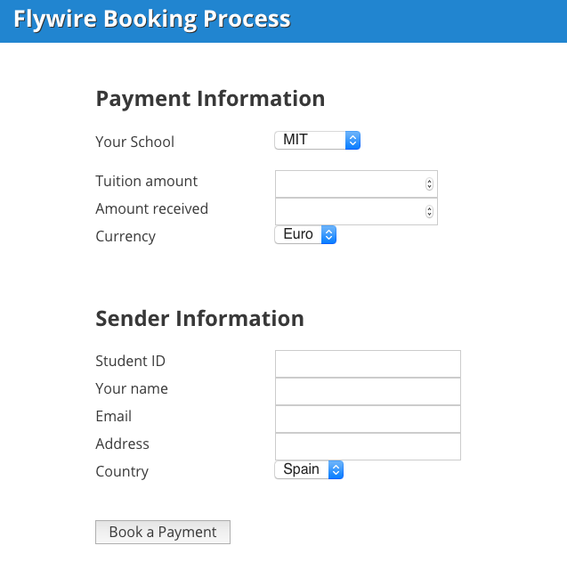
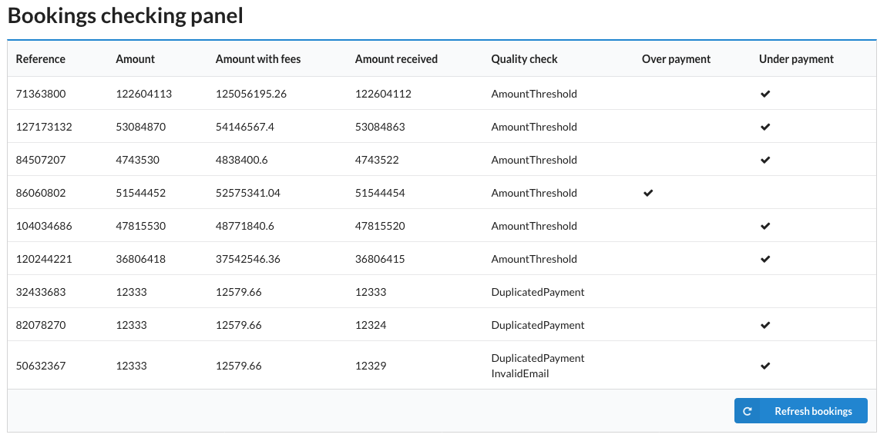

# Exercise

The purpose of this step is to provide our candidates an opportunity to show their testing skills: analysis, thinking power, communication, collaboration and automation capabilities.
 
Get ready to participate, communicate and share!.
 
We want you to test the whole system as you consider, using any testing strategies and techniques:
* Finding Defects
* Writing Test Scenarios
* Defect Reporting
* Providing Suggestions
* Providing Automation Strategy and Implementation
* Defining Performance Tests
 
We don't expect any modification on the code given, but you can add new artifacts. 
 
All your work, process and results should be published in the repository given.

Thank you so much for your time. 

Good luck.


# System Under Test

System is made up of a "Booking Portal" that is an application with the purpose of creating payment bookings.It consists on a payment form with the following structure:



When the form is submitted, the application creates a payment record with the provided information, and part of this information and other calculations are shown in the “Booking List” application.



When a payment is booked, it passes a "quality check", the purpose of this quality check is to assure that the payment meets some defined "quality" criteria, this criteria consists on the following rules:

* **InvalidEmail**: The payment has an invalid email.
* **DuplicatedPayment**: The user that booked the payment has already a payment in the system.
* **AmountThreshold**: The amount of the payment is bigger than 1.000.000$

The application shows in the booking list the reason of the "quality check" when the criteria meets.

Besides "quality check", the application checks for "over" and "under" payments:

* An **over-payment** happens when the user pays more than the tuition amount we introduced in the booking portal.
* An **under-payment** is just the opposite.

As a final step, the application shows the amount with fees depending on the magnitude of the amount, these fees are:

* if the amount < 1000 USD: 5% fees
* if the amount > 1000 USD AND < 10000 USD: 3% fees
* if the amount > 10000 USD: 2% fees


# Getting started

## Requirements

- [docker](https://www.docker.com)
- [docker-compose](https://docs.docker.com/compose/install/)

## Setup

To run the project, do the following on the root folder:

1. Start `docker-compose` to boot the application.

		$ docker-compose up
		
	The application will be running when *client* and *server* appear running in the console.


NOTES:

1. To stop the application execute:

		$ docker-compose stop

2. To run the booking portal test execute:

		$ docker-compose run server bundle exec rspec

3. To clean the database execute the rake `db:reset` in the server container:

		$ docker exec tester_hiring_exercise_server_1 bundle exec rake db:reset

	And then restart applications.

		$ docker-compose restart


## Usage

The booking portal interface is on:

		http://localhost:9292/payment

The booking list interface is on:

		http://localhost:9191/bookings

## Examples of E2E Tests using Cypress Framework

Test scenarios automated basic examples are available in:
- ```\test\cypress\integration```
- access-payments-website.spec.js
- access-bookings-checking-panel.spec.js

Page Objects can be found in ```\test\cypress\page_objects```
- PaymentsPage.js
- BookingPanelPage.js

### How to run the E2E tests
1.	Clone the project.
2.	Execute in the command line ```npm install``` in the ```test``` folder in order to install the dependencies.
3.	Execute in the command line ```npm run cypress:open```.
4.	Cypress menu with all the tests available will be displayed.
5.	Select ```Run all specs```.
6.	New Chrome browser will be opened and the tests will be executed.